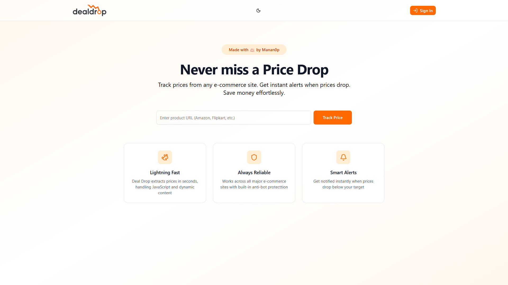
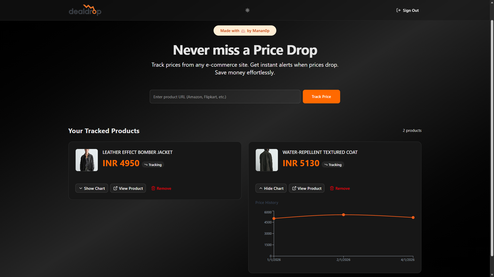

# DealDrop: Smart Price Tracker

**DealDrop** is a modern price tracking web app that lets you save product links from e-commerce sites, automatically checks prices on a schedule, stores price history, and emails you when a price drops.

**🌐 Live Demo:** https://dealdrop-one.vercel.app/

## 🖼️ Product Tour

Here’s a quick look at the app experience — from the landing page to tracking products and monitoring price movement.

### Landing + Tracking

Clean landing page with sign-in, product URL input, and your tracked products in one place.



### Price Monitoring

Track updates over time with saved history and charts so you can spot drops quickly.



---

## 🎯 What This Project Does

DealDrop is built around one simple flow: **paste a product URL → scrape price → store history → alert on drops**.

It helps you:
- Track products from many e-commerce sites (including dynamic pages)
- Maintain a full price history for each product
- See trends via charts
- Get notified when the price goes down

---

## ✨ Core Features

- **🔐 Authentication** - Google OAuth via Supabase
- **🔗 Product Tracking by URL** - Add products by pasting a link
- **⚡ Smart Scraping** - Extracts product name, current price, currency, and image using Firecrawl
- **📉 Price History** - Stores every price change in a dedicated `price_history` table
- **📊 Charts & Trends** - Visualize price movement with Recharts
- **📧 Price Drop Alerts** - Sends email alerts through Resend when prices decrease
- **⏱️ Scheduled Checks** - Protected cron endpoint to update all tracked products
- **🌙 Dark/Light Theme** - Theme toggle with persisted preference

---

## 👥 Who Is This For?

Perfect for learning/building:
- **Full-stack Next.js**: App Router, server actions, serverless routes
- **Auth + Database**: Supabase SSR helpers, session-aware UI
- **Scraping Pipelines**: Reliable extraction with structured JSON output
- **Background Jobs**: Cron-triggered workflows with secure authentication
- **Email Automation**: Transactional alerts via Resend
- **Charts + UX**: Responsive UI + data visualization

---

## 🛠 Tech Stack

### Frontend
- **Next.js 16** - App Router
- **React 19** - UI library
- **Tailwind CSS v4** - Styling
- **ShadCN UI** - Component patterns (in `components/ui`)
- **Recharts** - Charts
- **Lucide React** - Icons

### Backend & Services
- **Supabase** - Authentication + database
- **@supabase/ssr** - Session-aware server/client helpers
- **Firecrawl** - Web scraping for dynamic pages
- **Resend** - Transactional email for alerts

### Deployment
- **Vercel** - Hosting + serverless routes

---

## 📁 Project Structure

```text
dealdrop/
├── app/
│   ├── api/
│   │   └── cron/
│   │       └── check-prices/
│   │           └── route.js          # Protected cron endpoint (POST)
│   ├── auth/
│   │   └── callback/
│   │       └── route.js              # Supabase OAuth callback
│   ├── actions.js                    # Server actions (add/get/delete product, history, sign out)
│   ├── layout.js
│   ├── page.jsx                      # Landing + tracked products UI
│   └── globals.css
├── components/
│   ├── AddProductForm.jsx
│   ├── AuthButton.jsx
│   ├── AuthModal.js
│   ├── PriceChart.jsx
│   ├── ProductCard.jsx
│   ├── ThemeProvider.jsx
│   ├── ThemeToggle.jsx
│   └── ui/                           # shadcn-style primitives
├── lib/
│   ├── email.js                      # Resend email alert template + sending
│   ├── firecrawl.js                  # Firecrawl scraping helper
│   └── utils.js                      # cn() helper
├── utils/
│   └── supabase/
│       ├── client.js                 # Browser client
│       ├── middleware.js             # Session refresh middleware helper
│       └── server.js                 # Server client (cookies)
├── public/
├── next.config.mjs
└── package.json
```

---

## 🚀 Quick Start

### 1) Prerequisites

- Node.js 18+
- npm (or yarn/pnpm)
- A Supabase project (Google OAuth enabled)
- Firecrawl API key
- Resend API key + verified sender email

### 2) Install dependencies

```bash
npm install
```

### 3) Environment variables

Create a `.env.local` file:

```env
# Supabase
NEXT_PUBLIC_SUPABASE_URL=your_supabase_project_url
NEXT_PUBLIC_SUPABASE_PUBLISHABLE_KEY=your_supabase_anon_key

# Required for cron job (bypasses RLS)
SUPABASE_SERVICE_ROLE_KEY=your_supabase_service_role_key

# Scraping
FIRECRAWL_API_KEY=your_firecrawl_key

# Email alerts
RESEND_API_KEY=your_resend_key
RESEND_FROM_EMAIL=your_verified_sender@domain.com

# Used in email footer links
NEXT_PUBLIC_APP_URL=http://localhost:3000

# Protects the cron endpoint
CRON_SECRET=some_strong_random_token
```

### 4) Configure Supabase OAuth Redirect URLs

In Supabase Auth settings, add:
- `http://localhost:3000/auth/callback` (development)
- `https://dealdrop-one.vercel.app/auth/callback` (production)

### 5) Start the dev server

```bash
npm run dev
```

Open http://localhost:3000

---

## 🌐 API Routes

| Route | Method | Auth | Purpose |
|------|--------|------|---------|
| `/` | GET | Supabase session (optional) | Landing page + user’s tracked products |
| `/auth/callback` | GET | No | Completes Supabase OAuth flow |
| `/api/cron/check-prices` | GET | No | Health message |
| `/api/cron/check-prices` | POST | Yes (`CRON_SECRET`) | Scrape + update prices, store history, send alerts |

---

## 💾 Database Schema (Supabase)

DealDrop expects two tables:

### `products`

Typical fields (based on app usage):
- `id`
- `user_id`
- `url`
- `name`
- `current_price`
- `currency`
- `image_url`
- `created_at`, `updated_at`

### `price_history`

The app writes a row whenever the price changes:
- `id`
- `product_id`
- `price`
- `curency` (note: column name is intentionally spelled this way in code)
- `checked_at`

---

## 📊 How It Works (End-to-End)

1. **User logs in** using Google OAuth (Supabase)
2. **User adds a product URL** from the UI
3. **Server action scrapes** product info via Firecrawl and upserts into `products`
4. **If price changed**, the app inserts a row into `price_history`
5. **Cron endpoint** periodically scrapes all products using the Supabase service role key
6. **If price drops**, DealDrop sends an email via Resend

---

## ⏱️ Cron / Scheduled Checks

The cron endpoint is protected by a bearer token:

- **Endpoint:** `POST /api/cron/check-prices`
- **Header:** `Authorization: Bearer <CRON_SECRET>`

Example (PowerShell):

```powershell
curl.exe -X POST https://dealdrop-one.vercel.app/api/cron/check-prices -H "Authorization: Bearer YOUR_CRON_SECRET"
```

To automate it, configure a scheduler (e.g., Vercel Cron) to call that endpoint at your desired interval.

---

## 🐛 Troubleshooting

| Issue | Likely Cause | Fix |
|------|--------------|-----|
| App loads but auth doesn’t work | Missing Supabase keys or redirect URLs | Set env vars and add `/auth/callback` redirect URLs |
| Cron returns `401 Unauthorized` | Missing/wrong `CRON_SECRET` header | Send `Authorization: Bearer <CRON_SECRET>` |
| Cron returns `500 Supabase environment variables are missing` | Missing service role key | Set `SUPABASE_SERVICE_ROLE_KEY` on server (never client) |
| Scrape fails or returns no price | Site blocks scraping or DOM is complex | Try another URL, confirm Firecrawl quota/key, adjust prompt/schema |
| Emails not sent | Resend sender not verified / API key missing | Verify `RESEND_FROM_EMAIL`, set `RESEND_API_KEY` |
| Price history not inserting | DB schema mismatch | Ensure `price_history` has `curency` + `checked_at` columns |

---

## 🚢 Building for Production

```bash
npm run build
npm run start
```

---

## 📝 Scripts

- `npm run dev` - Start development server
- `npm run build` - Build for production
- `npm run start` - Start production server
- `npm run lint` - Run ESLint

---

## 🔐 Security Notes

⚠️ For production:
- Never expose `SUPABASE_SERVICE_ROLE_KEY` to the client
- Keep `CRON_SECRET` long and random; rotate it if leaked
- Enable/verify Supabase RLS policies for all tables
- Consider rate-limiting the cron route and adding request logging

---

## 🔄 Extending the Project

Easy additions:
- Add per-product target price thresholds
- Add notification preferences (email on any drop vs. only big drops)
- Add scrape retries + backoff and better UI error surfacing
- Add multi-currency formatting and locale-aware display

Advanced additions:
- Add background queues for scraping (instead of synchronous cron)
- Add browser extension to “track this product” from any page
- Add webhook integrations (Slack/Discord) for alerts

---

## 🤝 Contributing

Contributions are welcome! Please open an issue or submit a Pull Request.

---

## 📝 License

This project is licensed under the **MIT License** - see the [LICENSE](LICENSE) file for details.

**Copyright © 2026 Manan**

---

## 👨‍💻 Author

Built by Manan.

---

## 🙏 Acknowledgments

- Supabase for auth + database
- Firecrawl for scraping product pages
- Resend for powering email alerts
- Vercel for hosting

---

**Ready to save money? Visit https://dealdrop-one.vercel.app/ and start tracking.**
